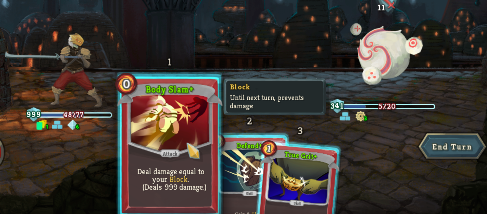

# Slay The Spire

its cool because the card can synergize in so many silly and insane ways and there's always new builds to try and more overpowered strats to use like this one. 

discovering new strats with each character is extremely rewarding, especially with actually winning being as difficult as it is. You really have to understand the cards an plan way ahead to have a chance, if you don't manage to build a perfect deck that is. Very fun, very inspiring game.
## Developer
[Mega Crit Games](https://www.megacrit.com/) (Published by Humble Bundle)
## Release Date
January 23, 2019 (although it was released in Early Access in late 2017)
## Engine
libGDX (never heard of this one before)
## Similar Games
- [Monster Train](https://www.themonstertrain.com/)
- [Dicey Dungeons](https://diceydungeons.com/)
- [Dancing Duelists](https://megacrit.itch.io/dancing-duelists)(game jam game mega crit made recently)

